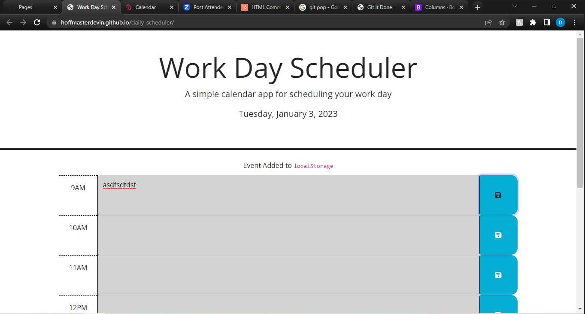

This is a webpage for using a daily planner to create a schedule, displaying the current date at the top of the page. There are timeblocks for each hour of the business day.

Each timeblock is color codded, depending on if that time has already passed, currently is, and will be in the future for that day.

Each timeblock can be filled in, and after pressing the save button to the right hand side of the timeblock, that information can be saved to localstorage, with an indication message appearing. Even after refreshing, this information persists.

https://hoffmasterdevin.github.io/daily-scheduler/

GIVEN I am using 
WHEN I open the planner
THEN the current day is displayed at the top of the calendar
WHEN I scroll down
THEN I am presented with timeblocks for standard business hours
WHEN I view the timeblocks for that day
THEN each timeblock is color coded to indicate whether it is in the past, present, or future
WHEN I click into a timeblock
THEN I can enter an event
WHEN I click the save button for that timeblock
THEN the text for that event is saved in local storage
WHEN I refresh the page
THEN the saved events persist